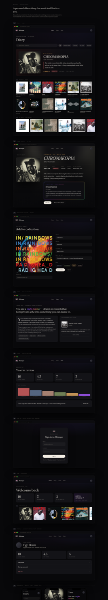

# Mixtape — Design Target

A full-fidelity, single-file design target for **Mixtape** — a personal album-listening diary. Not a description to argue over, a rendered surface to build against: five screens, the complete type and colour system, glass chrome, and one restrained iridescent AI moment.

**Live → [mixtape-design-target.vercel.app](https://mixtape-design-target.vercel.app)**



---

## What this is

One self-contained `index.html` — no build, no dependencies — rendering the whole app as an interactive, pixel-accurate target:

- **Diary** — the dense cover grid with a "Now spinning" hero band
- **Album Dossier** — full-bleed blurred-cover backdrop, title pinned to the top
- **Add** — the entry flow
- **Taste** — the AI listening portrait
- **Stats** — computed listening data
- Plus the **mobile system** across all of the above

The point is to remove the bottleneck of negotiating design in prose. The fidelity *is* the spec.

## Design system

| | |
|---|---|
| **Surfaces** | base `#08080A`, cards `#131317`, hairlines `rgba(242,237,228,.09)`, one faint top-centre radial glow for depth — never flat grey |
| **Type** | Fraunces (display serif, italic for hero titles and notes) · Inter (body/UI) · Space Mono (eyebrows, uppercase, `.2em` tracking) |
| **Scale** | real jumps — 48–64px titles → 15px body → 11px eyebrows. No mid-range timidity |
| **Text** | cream `#F2EDE4` at ~82% on near-black |
| **Accent** | amber `#E0A458` — ratings only |
| **AI** | the iridescent gradient appears on exactly one surface: the taste-concierge card border. Nowhere else — the restraint is what makes it read as special |

**Signature moves:** the "Now spinning" hero band · the dense cover grid with hover-rise · the full-bleed blurred-cover Dossier · the single iridescent AI card.

Brand asset: [`assets/cassette-mark.svg`](assets/cassette-mark.svg) — vector logomark (matte body, iridescent reels, cream label strip).

## Three directions

The rendered target is direction 1; the other two are documented spines to graft across.

1. **Midnight Diary** *(built — this target)* — dark editorial, content-led, restrained. The Vercel / Linear / Anthropic axis done for music. The recommended spine.
2. **Liner Notes** — pushes the editorial further: leader-dot tracklists (`01 ........ 3:42`), footnoted notes, tape-ribbon dividers between "sides."
3. **Cassette Deck** — tactile hi-fi framing: VU-meter stats, tape-reel loader, Side A / Side B tabs, spine-label list view.

## Run it locally

```bash
git clone https://github.com/Ege-Deniz/mixtape-design-target.git
cd mixtape-design-target
python3 -m http.server 8910
# open http://localhost:8910
```

Or just open `index.html` directly in a browser.

## Stack

Plain HTML, CSS, and vanilla JS in a single file. Fonts via Google Fonts (Fraunces, Inter, Space Mono). Deployed as a static site on Vercel.

---

Part of [rowy.engineer](https://rowy.engineer).
